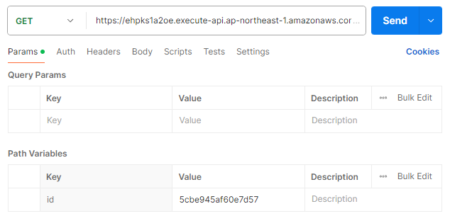

# async-api

This is the instruction for creating a docker image to be used in AWS ECS for async-api to process pointcloud data.

## Execute PointCloud processing API

1. Edit the `entrypoint.sh` script, which executes pre-install third-party **PointCloud processing** programs (i.e. CloudCompare).
```bash
eval timeout 5m CloudCompare -SILENT -O "$FILE_NAME" "$CC_OPTION"
# NOTE CloudCompare is pre-install as specified in Dockerfile
```
2. Confirm `entrypoint.sh` exists and executable in `Dockerfile`
```dockerfile
COPY entrypoint.sh ./script/entrypoint.sh
RUN chmod 755 ./script/entrypoint.sh
ENTRYPOINT /tmp/script/entrypoint.sh
```
3. Build `docker image` by running 
```bash
docker build --tag <your-image-name> .
```
4. Upload `docker image` to AWS ECR
```bash
# log in to ECR
aws ecr get-login-password --region ap-northeast-1 | docker login --username AWS --password-stdin <aws account>.dkr.ecr.ap-northeast-1.amazonaws.com

# tag the image to be used in ECR
docker tag pointcloud:latest <aws account>.dkr.ecr.ap-northeast-1.amazonaws.com/pointcloud:latest

# push the image to ECR
docker push <aws account>.dkr.ecr.ap-northeast-1.amazonaws.com/pointcloud:latest
```
5. AWS ECS settings

Add ECR URL to `Task definiton` in ECS

6. Execute API with Postman

Endpoint: `https://<your-image-name>.<aws account>.dkr.ecr.ap-northeast-1.amazonaws.com/pointcloud`


- `download_url`: the url to download the pointcloud data from
- `file_name`: rename the downloaded pointcloud data
- `command`: the option to be passed to CloudCompare to process the pointcloud data

The above API triggers Lambda Function -->:arrow_right: start ECS container --> run docker container --> exec entrypoint.sh with the following steps:

- download the pointcloud data from the specified url
- run CloudCompare to process the pointcloud data
- upload the processed pointcloud data to the specified url
- post the downloadable url to DynamoDb table

## GET PointCloud Processing status API
- **GET** task_id related info from DynamoDb

    Endpoint: `https://ehpks1a2oe.execute-api.ap-northeast-1.amazonaws.com/pointcloud/results/:task_id`

- **GET** result_id related info from DynamoDb

    Endpoint: `https://ehpks1a2oe.execute-api.ap-northeast-1.amazonaws.com/pointcloud/results/:result_id`

    